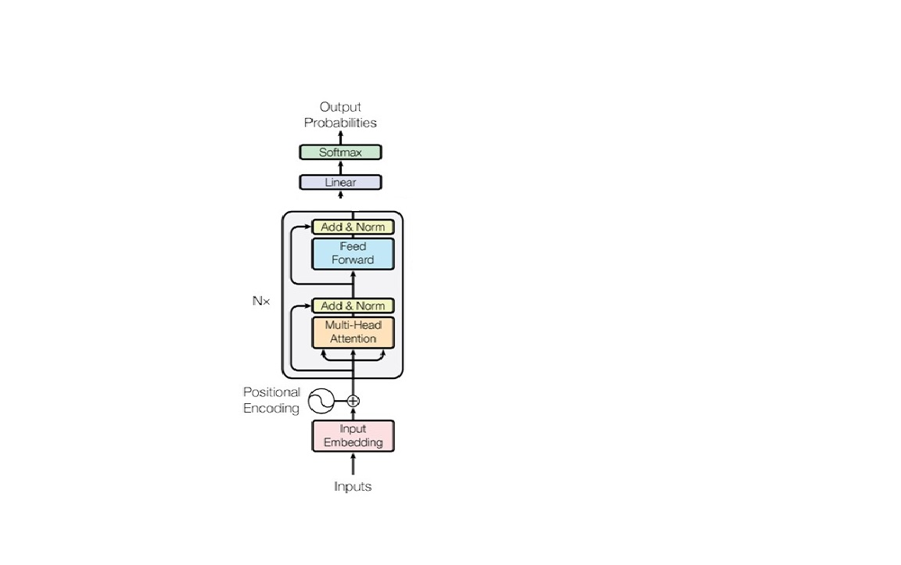
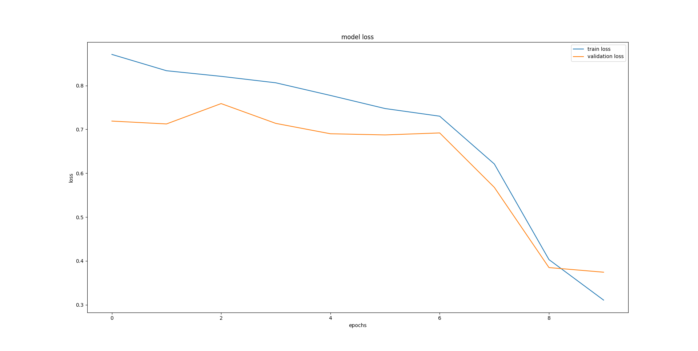

# Sentiment Anaysis using Transformers
build end to end customized transformer model for sentiment anaysis.

# Reference paper : 
"**Attention Is All You Need**"
https://arxiv.org/abs/1706.03762

[Note : only encoder section ]

# Architecture :

# Main components
1. [**Positional Encoding**](/SentimentAnaysis_using_Transformers/com/iqvia/Positional_Embedding.py)
2. [**Embedding Layer**](/SentimentAnaysis_using_Transformers/com/iqvia/Embeddings.py)
3. [**Transformer Encoding**](/SentimentAnaysis_using_Transformers/com/iqvia/TransformerEncoder.py)
4. Flatten layers and add Dense layer with softmax function
5. [**Transformer Model**](/SentimentAnaysis_using_Transformers/com/iqvia/TransformerModel.py)
   
## train and validation loss :

